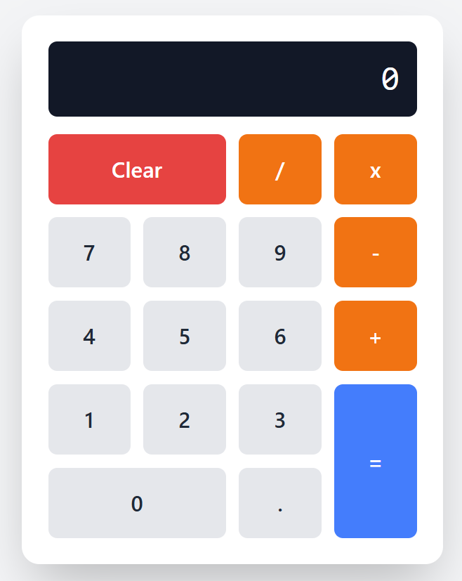

# Simple Calculator

A basic calculator application built using **React**, **Tailwind CSS**, and **Vite**.  
Designed for everyday use with a clean and distraction-free interface.

## Features

- Perform basic arithmetic operations:
  - Addition
  - Subtraction
  - Multiplication
  - Division
  - Decimal calculations
- Clean and responsive UI
- Follows clean code practices

## Preview



## Tech Stack

- React
- Tailwind CSS
- Vite

Any recommendations and improvements are welcomed

## Getting Started

To run the project locally:

```bash
git clone https://github.com/VikingForcee/my-calculator-react.git
cd my-calculator-react
npm install
npm run dev
